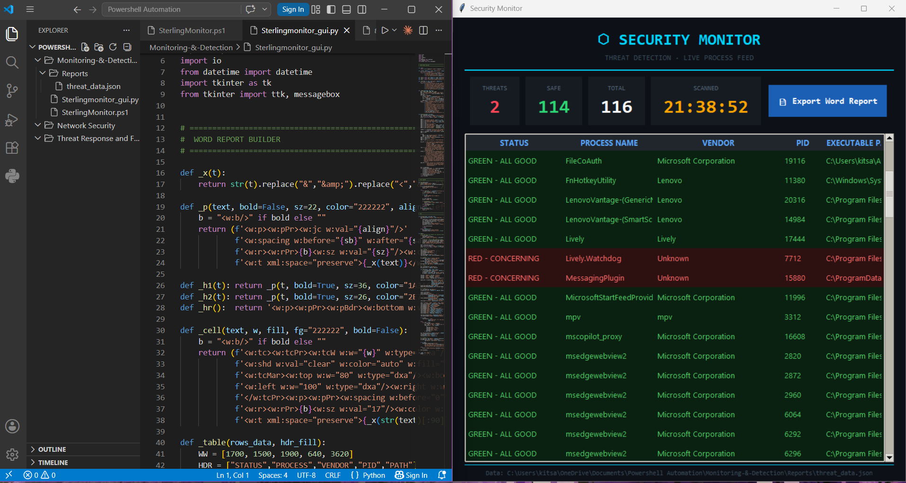

#  Endpoint Monitoring & Threat Detection 

This module provides a proactive security layer by auditing system-level processes to identify "Living off the Land" (LotL) threats and unsigned binaries. 

##  Overview
I engineered a cross-platform solution that bridges administrative PowerShell automation with a Python-based visualization layer. This tool allows security analysts to triage system health at a glance.

### 📊 Detection Dashboard

## 🛠️ How it Works
1. **The Engine (PowerShell):** - Audits all active processes with high-level administrative privileges.
   - Cross-references **Vendor Metadata** and **Digital Signatures**.
   - Applies **Heuristic Logic** to flag processes running from high-risk directories (e.g., `%TEMP%`, `Downloads`, or `%APPDATA%`).
   - Generates a structured `JSON` telemetry feed and a formatted `Security_Audit_Report.txt` for compliance logging.

2. **The Dashboard (Python):** - A custom **Tkinter GUI** that consumes the JSON telemetry.
   - Provides real-time statistics (Threat Count vs. Safe Processes).
   - Features a color-coded triage system: `RED` for high-risk anomalies and `GREEN` for verified system processes.

## 🧰 Technical Stack
* **Automation:** PowerShell (Process API, WMI)
* **Visualization:** Python 3.x (Tkinter, Threading)
* **Data Format:** JSON (Standardized telemetry bridge)
* **Design:** "Stealth Wealth" inspired dark-mode UI for high-contrast visibility.

---
