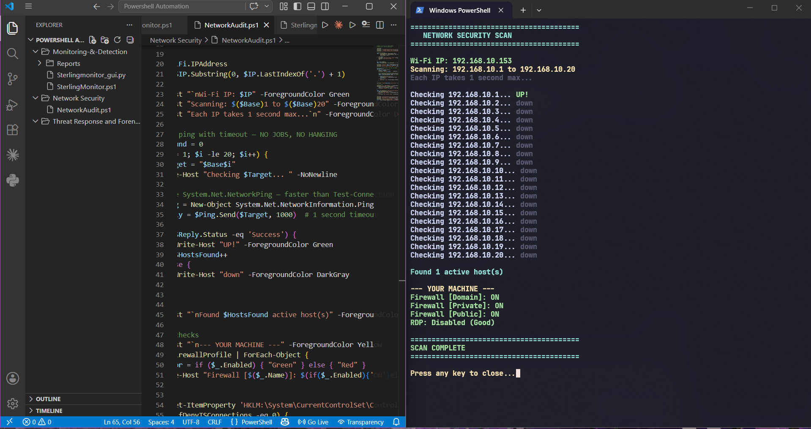

#  Network Security Audit — PowerShell Automation

> **Module:** Network Security | **Script:** `NetworkAudit.ps1`  
> **Language:** PowerShell | **Environment:** Windows (VS Code + Integrated Terminal)  
> 

---

## 📸 Live Scan Output



> **What you're seeing:** `NetworkAudit.ps1` running a live network sweep across the `192.168.10.1–20` subnet. The script auto-detects the host machine's Wi-Fi IP (`192.168.10.153`), derives the subnet base, and pings each address with a 1-second timeout using `System.Net.NetworkInformation.Ping` — faster and more reliable than `Test-Connection`. It found **1 active host**, then immediately ran local security checks: Firewall status across all three profiles (Domain ✅, Private ✅, Public ✅) and confirmed RDP is **disabled** — a positive security posture indicator.

---

## 📌 Overview

`NetworkAudit.ps1` is a lightweight but powerful PowerShell automation script that performs **host discovery and local security hardening checks** in a single pass. It is designed for rapid network triage — ideal for the reconnaissance and posture-assessment phases of a VAPT engagement.

No third-party tools required. Pure PowerShell, native Windows APIs.

---

## ⚙️ What the Script Does

### 1. 🌐 Auto-Detects Your Network
- Retrieves the active **Wi-Fi IP address** from the network adapter
- Extracts the **subnet base** (e.g. `192.168.10.`) dynamically via string manipulation — no hardcoded ranges

### 2. 🔎 Host Discovery Sweep
- Iterates through `.1` to `.20` of the detected subnet
- Uses `System.Net.NetworkInformation.Ping` with a **1000ms timeout** for fast, non-blocking checks
- Colour-coded output: `UP` in **Green**, `down` in **DarkGray**
- Counts and reports total **active hosts found**

### 3. 🛡️ Local Security Posture Checks
After the sweep, the script audits the **local machine's security configuration**:

| Check | Method | Good Result |
|-------|--------|-------------|
| Firewall (Domain) | `Get-NetFirewallProfile` | ✅ ON |
| Firewall (Private) | `Get-NetFirewallProfile` | ✅ ON |
| Firewall (Public) | `Get-NetFirewallProfile` | ✅ ON |
| RDP Status | `HKLM:\System\CurrentControlSet\...fDenyTSConnections` | ✅ Disabled |

---


---

## ▶️ Usage

```powershell
# Run as Administrator for full firewall + registry access
Set-ExecutionPolicy -Scope Process -ExecutionPolicy Bypass
.\NetworkAudit.ps1
```

The script is fully self-contained — no arguments needed. It auto-detects the local IP and derives the scan range automatically.

---

## 🧠 Key Technical Decisions

| Design Choice | Why |
|---------------|-----|
| `System.Net.NetworkInformation.Ping` over `Test-Connection` | Faster, no hanging, precise 1s timeout control |
| Dynamic subnet extraction via `.LastIndexOf('.')` | No hardcoded IPs — works on any `/24` network |
| Registry query for RDP state | More reliable than WMI for detecting actual RDP policy |
| Colour-coded terminal output | Instant visual triage — no parsing required |

---

## 📊 Sample Output

```
======================================
        NETWORK SECURITY SCAN
======================================
Wi-Fi IP: 192.168.10.153
Scanning: 192.168.10.1 to 192.168.10.20
Each IP takes 1 second max...

Checking 192.168.10.1...  UP!
Checking 192.168.10.2...  down
...
Checking 192.168.10.20... down

Found 1 active host(s)

--- YOUR MACHINE ---
Firewall [Domain]:  ON
Firewall [Private]: ON
Firewall [Public]:  ON
RDP: Disabled (Good)

======================================
           SCAN COMPLETE
======================================
```

---

## 🔗 MITRE ATT&CK® Mapping

| Technique | ID | Defensive Relevance |
|-----------|-----|-------------------|
| Network Service Discovery | T1046 | Identifying active hosts on the segment |
| Remote Desktop Protocol | T1021.001 | Confirming RDP is disabled to block lateral movement |
| System Firewall Discovery | T1518.001 | Auditing firewall state across all profiles |

---

## 🔄 Part of a Larger Suite

This script sits within the **Network Security** module of a broader PowerShell automation suite:

- 🖥️ **Monitoring & Detection** — `Sterlingmonitor.ps1` + Python GUI (`Sterlingmonitor_gui.py`)
- 🌐 **Network Security** — `NetworkAudit.ps1` ← *you are here*
- 🚨 **Threat Response & Forensics** — *(in development)*

---

## ⚠️ Disclaimer

This tool is intended for **authorised network auditing and defensive security assessments only**. Only run against networks and systems you own or have explicit written permission to test.

---

*Part of the [VAPT Security Audit](../README.md) portfolio — a structured penetration testing and security automation project.*
